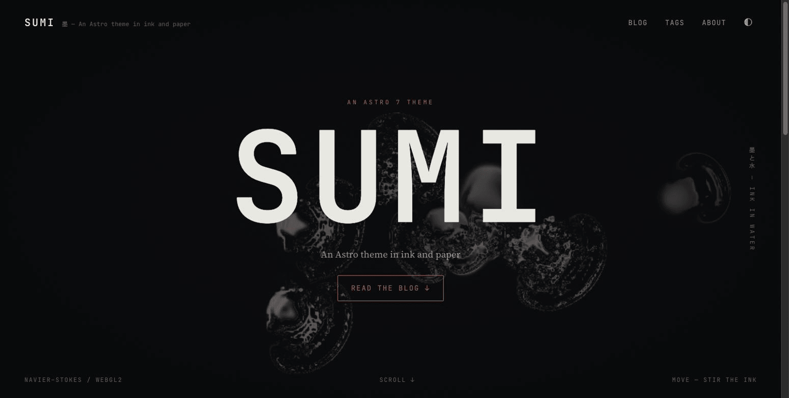
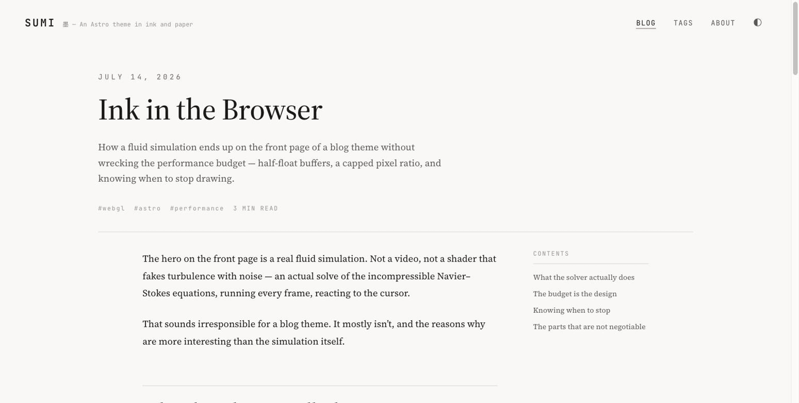

# Sumi 墨

An Astro 7 blog theme built around ink, washi paper and generous negative space.

Dual light and dark palettes from a single set of tokens, no external requests, no client JavaScript on article pages — and a real WebGL fluid simulation behind the front page that you can stir with the cursor.

[Japanese README →](./README.ja.md)




## Features

- **Light and dark, declared once.** Colours are written with `light-dark()` and driven by `color-scheme`, so the toggle sets one attribute and the whole page follows. With JavaScript off, the OS preference still wins.
- **No external requests.** Latin faces are self-hosted and subset; Japanese falls through to the system mincho stack rather than shipping a multi-megabyte CJK font.
- **Nothing to hydrate.** Article pages ship zero external JavaScript. The theme toggle is a few hundred inlined bytes; the ink is 3.5 KB gzipped and loads on the front page only.
- **A fluid simulation, responsibly.** Navier–Stokes on the GPU, capped at 1.5× DPR, paused off-screen, and skipped entirely for `prefers-reduced-motion` or browsers without WebGL2 — a static gradient stands in.
- **Content collections with a schema.** A missing date or malformed tag fails the build, not the page. Markdown and MDX both work.
- **SEO out of the box.** Canonical URLs, Open Graph, Twitter cards, JSON-LD (`WebSite` / `BlogPosting`), sitemap, RSS, `robots.txt` and `llms.txt`.
- **Per-post social images.** Generated at build time with satori — ink ground, vermilion rule, monospace type.
- **Dual-theme syntax highlighting.** Shiki emits both palettes; the toggle switches them with everything else.
- **Accessible by construction.** Semantic landmarks, a skip link, visible focus rings, and contrast checked in both themes.

## Quick start

```bash
git clone https://github.com/kpab/astro-sumi.git
cd astro-sumi
npm install
npm run dev
```

Requires **Node.js 22.12 or newer**. Astro does not support odd-numbered Node releases, so use 22 or 24.

| Command           | Does                                     |
| ----------------- | ---------------------------------------- |
| `npm run dev`     | Start the dev server on `localhost:4321` |
| `npm run build`   | Build to `./dist`                        |
| `npm run preview` | Serve the built site locally             |
| `npm run check`   | Type check with `astro check`            |

## Configuration

Everything you need to change lives in [`src/config.ts`](./src/config.ts).

```ts
export const SITE = {
  url: "https://your-domain.com", // no trailing slash
  title: "Sumi",
  titleMark: "墨", // set to "" to drop the Japanese accents
  tagline: "An Astro theme in ink and paper",
  description: "…",
  lang: "en",
  locale: "en_US",
  defaultOgImage: "/og-default.png",
};

export const AUTHOR = { name: "…", url: "…", bio: "…" };
export const NAV = [{ label: "Blog", href: "/blog" } /* … */];
export const SOCIAL = [{ label: "GitHub", href: "…" }];

export const BLOG = {
  postsPerPage: 4, // 8–12 suits a real archive
  postsOnHome: 4,
  wordsPerMinute: 220,
  showReadingTime: true,
  showTableOfContents: true,
  tocMinHeadings: 3,
};

export const INK = {
  hero: true, // full-bleed simulation behind the hero
  divider: true, // narrow ink band between sections
  strength: 1, // 0.3 – 2.5
  autoFlow: true, // drift on its own, not just under the cursor
};

export const OG = { enabled: true, width: 1200, height: 630 };
```

Setting both `INK` flags to `false` leaves the theme with no external JavaScript at all — the hero keeps a static ink gradient.

### What the ink costs

Measured with Lighthouse under its default mobile profile (4× CPU throttling, slow 4G) against `npm run preview`, which serves uncompressed:

| Page                     | Performance | Accessibility | Best practices | SEO |
| ------------------------ | ----------: | ------------: | -------------: | --: |
| Article                  |       85–96 |           100 |            100 | 100 |
| Home, `INK.hero: true`   |       74–81 |           100 |            100 | 100 |
| Home, `INK.hero: false`  |          93 |           100 |            100 | 100 |

LCP on the home page is 1.9 s and CLS is 0 either way — the simulation is deferred until the browser is idle, so it never blocks first paint. What it does cost is blocking time while the shaders compile, which is why the front page scores lower than an article. A real host with compression, and a device that is not being throttled fourfold, both do better than these numbers.

If you want the front page in the high nineties, turn `INK.hero` off. The article range depends on how much highlighted code a post contains.

## Writing posts

Posts are Markdown or MDX files in `src/content/blog/`. The filename becomes the URL.

```markdown
---
title: "The Grammar of Negative Space"
description: "Shown in the post list, the meta description and the OG image."
pubDate: 2026-07-28
updatedDate: 2026-08-01 # optional
tags: ["design", "craft"]
draft: false # drafts are visible in dev, dropped from builds
heroImage: ./cover.jpg # optional, optimised through astro:assets
heroImageAlt: "…"
---

Your text here.
```

The schema lives in [`src/content.config.ts`](./src/content.config.ts). Files whose names begin with `_` are ignored entirely.

Note that Astro 7 replaced remark/rehype with [Sätteri](https://satteri.bruits.org/), so remark plugins no longer apply. This theme deliberately depends on none: the table of contents is built from the headings Astro already returns, and reading time is computed from the post body.

## Structure

```
src/
├── config.ts              ← the only file you need to edit
├── content.config.ts      collection schema
├── content/blog/          your posts
├── assets/fonts/          TrueType used to render OG images (not served)
├── components/            header, footer, cards, ink, SEO head
├── layouts/               BaseLayout, PostLayout
├── pages/
│   ├── index.astro        hero + latest posts
│   ├── blog/              list, pagination, post pages
│   ├── tags/              tag index and archives
│   ├── og/                per-post social images
│   └── rss.xml.ts  llms.txt.ts  robots.txt.ts
├── scripts/fluid-ink.ts   the WebGL ink custom element
├── styles/                tokens, global, fonts, prose
└── utils/                 posts, dates, reading time, OG rendering
public/fonts/              self-hosted woff2 + OFL licence
```

## Customising

**Colours.** All of them are in [`src/styles/tokens.css`](./src/styles/tokens.css), declared once with `light-dark(light, dark)`. Change the palette block and both themes follow. The ink simulation reads `--ink-canvas-bg`, `--ink-pigment` and `--ink-accent` from the same file, and decides whether to lay ink onto paper or glow it on black from the background's luminance — so a custom palette needs no extra work.

**Type.** `--font-serif` and `--font-mono` in the same file. To swap the Latin faces, drop new `.woff2` files into `public/fonts/` and update [`src/styles/fonts.css`](./src/styles/fonts.css). To add a Japanese webfont rather than using the system mincho stack, add an `@font-face` there.

**Ink.** Tuned in [`src/scripts/fluid-ink.ts`](./src/scripts/fluid-ink.ts): the solve resolution, the 22-iteration pressure solve, dissipation, and the ambient splat cadence all sit near the top of the frame loop.

**Syntax colours.** `markdown.shikiConfig` in [`astro.config.ts`](./astro.config.ts). Keep `defaultColor: false` so both palettes stay available to the toggle.

## Deploying

The theme builds to static files, so any host works.

**Cloudflare Pages** — connect the repository and set:

```
Build command:      npm run build
Build output:       dist
Node version:       24
```

**Netlify** — the same values, or commit a `netlify.toml`:

```toml
[build]
  command = "npm run build"
  publish = "dist"

[build.environment]
  NODE_VERSION = "24"
```

**Vercel** — Astro is detected automatically. Confirm the output directory is `dist` and the Node version is 24.

Whichever you pick, set `SITE.url` in `src/config.ts` to the deployed origin first — canonical URLs, the sitemap, the feed and the OG image URLs are all built from it.

## Credits

- [Source Serif 4](https://github.com/adobe-fonts/source-serif) by Adobe and [JetBrains Mono](https://github.com/JetBrains/JetBrainsMono) by JetBrains, both under the SIL Open Font License 1.1 (see [`public/fonts/LICENSE.txt`](./public/fonts/LICENSE.txt))
- Syntax colours from [Vitesse](https://github.com/antfu/vscode-theme-vitesse) via Shiki
- Social images rendered with [satori](https://github.com/vercel/satori) and [resvg](https://github.com/yisibl/resvg-js)

## Licence

MIT © [kpab](https://github.com/kpab)
